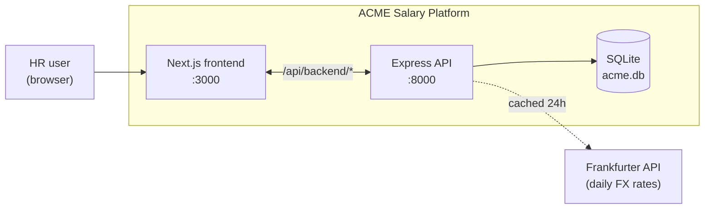
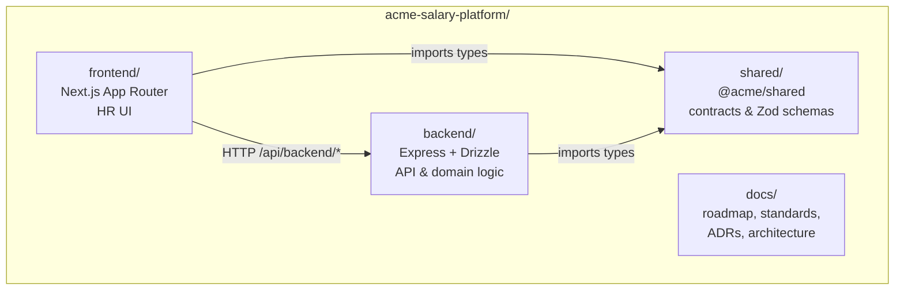
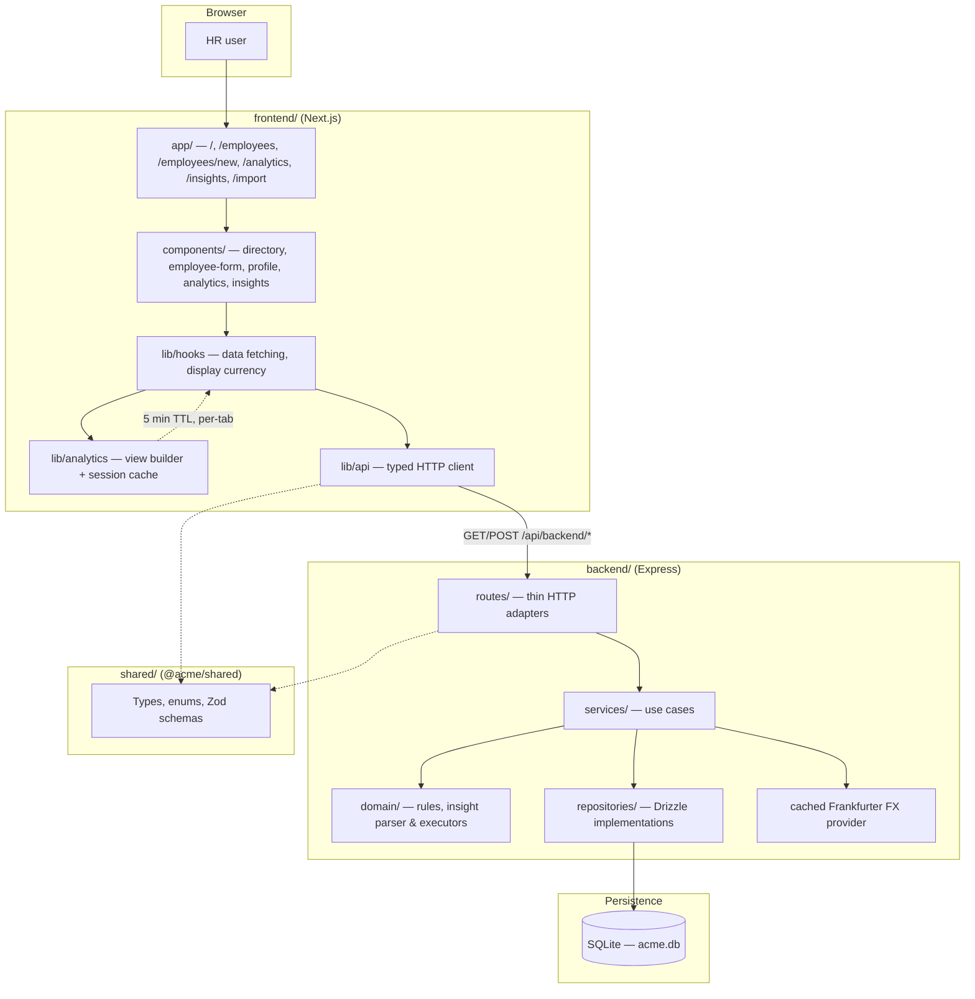
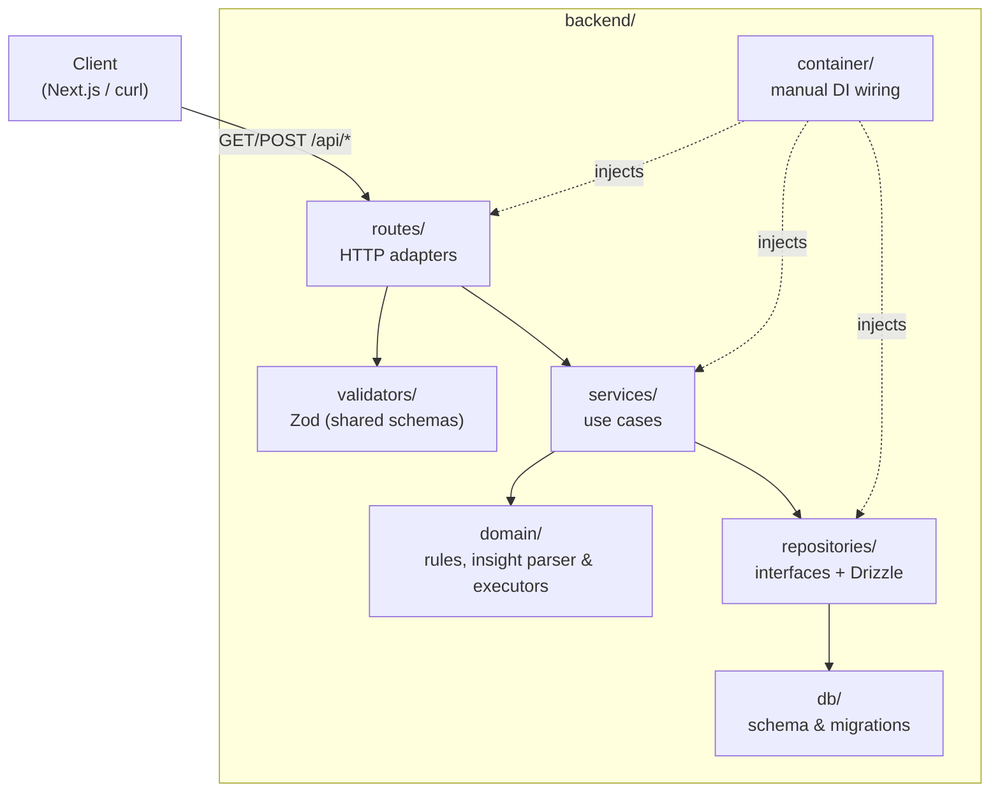
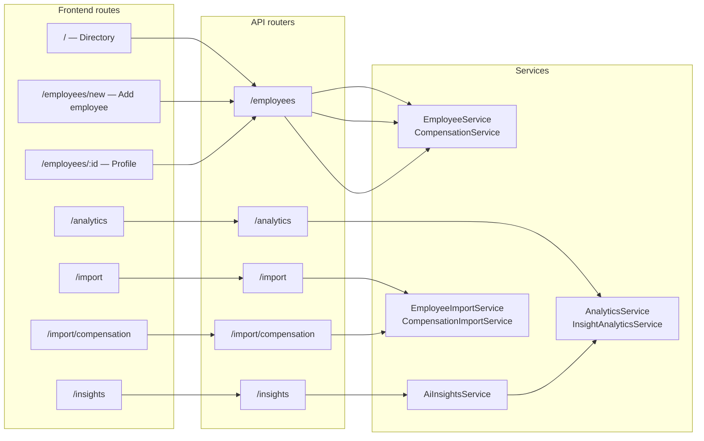
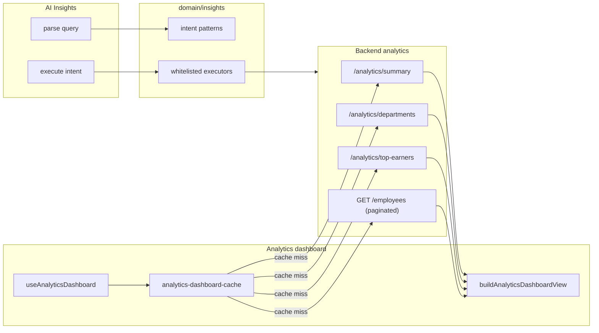

# Architecture

## Decision: one repo (monorepo)

```
acme-salary-platform/
├── backend/    → Express API, domain logic, Drizzle + SQLite
├── frontend/   → Next.js App Router (HR UI)
├── shared/     → API contracts, Zod schemas, currency helpers
├── docs/       → PRD, roadmap, standards, ADRs
└── AGENTS.md   → AI agent entry point
```

See [engineering-standards.md](./engineering-standards.md) for SOLID, TDD, and DI patterns.  
See [roadmap.md](./roadmap.md) for feature delivery plan.  
See [adr/README.md](./adr/README.md) for architecture decision records.

### Diagram index

| Diagram | What it shows |
|---------|----------------|
| [Context](#context) | Users, platform, external FX API |
| [Monorepo](#monorepo-packages) | `backend`, `frontend`, `shared`, `docs` |
| [System overview](#system-overview) | End-to-end runtime components |
| [Backend request flow](#backend-request-flow) | Express layers & dependency direction |
| [Feature modules](#feature-modules) | HR features mapped to routes & services |
| [Analytics & insights](#analytics--insights-data-flow) | Dashboard cache + whitelisted insight executors |

---

## Context

Who interacts with the system and what it depends on externally.



---

## Monorepo packages



---

## System overview



Server Components may call the backend directly. Client components use the Next.js proxy at `/api/backend/*` → backend `/api/*`.

---

## Stack

| Layer    | Choice                          |
|----------|---------------------------------|
| Frontend | Next.js 16, TypeScript, Recharts |
| Backend  | Express, TypeScript             |
| Database | SQLite, Drizzle ORM             |
| Shared   | npm workspaces (`@acme/shared`) |
| FX rates | Frankfurter API (cached 24h)    |
| Testing  | Vitest + Supertest              |

---

## Backend request flow

How an HTTP request moves through the backend. Business rules stay in `domain/`; SQL stays in `repositories/`.



Cross-cutting: env validation (Zod), logging (Pino), error middleware, Helmet, CORS.

API prefix: `/api/*`

### API surface (MVP)

| Area | Endpoints |
|------|-----------|
| Health | `GET /api/health` |
| Employees | `GET /api/employees`, `POST /api/employees`, `GET /api/employees/:id`, `PATCH /api/employees/:id`, `DELETE /api/employees/:id`, compensation timeline & `POST` history |
| Import | `POST /api/import/preview`, `confirm`; `POST /api/import/compensation/*` |
| Analytics | `GET /api/analytics/currencies`, `summary`, `departments`, `top-earners` |
| AI Insights | `POST /api/insights/parse`, `POST /api/insights/execute` |

---

## Frontend layers

```
app/                   routes (App Router)
components/            feature UI (directory, employee-form, profile, analytics, insights, import)
lib/api/               typed HTTP client
lib/hooks/             client state (display currency, dashboards, insights)
lib/analytics/         dashboard view model, charts, session cache
lib/env.ts             validated config
```

### Application routes

| Path | Purpose |
|------|---------|
| `/` | Employee directory (search, filters, KPIs) |
| `/employees/new` | Add employee form |
| `/employees/:id` | Compensation profile — edit/delete employee, record change |
| `/analytics` | Executive analytics dashboard |
| `/insights` | Natural-language compensation queries |
| `/import` | Employee spreadsheet import |
| `/import/compensation` | Compensation spreadsheet import |

Display currency is a global preference (persisted in `localStorage`) used by Analytics, directory salary display, and AI Insights.

---

## Feature modules

How major HR capabilities map across UI routes, API routers, and services.



---

## Analytics & insights data flow



- **Analytics:** server aggregates (summary, departments, top earners) plus client-derived charts from the employee list. FX conversion uses daily rates ([ADR 001](./adr/001-daily-frankfurter-exchange-rates-and-display-currency.md)). Repeat visits reuse a **5-minute session cache** ([ADR 002](./adr/002-analytics-dashboard-client-session-cache.md)).
- **AI Insights:** rule-based intent parser (no LLM SQL). Each intent maps to a whitelisted executor that calls the same analytics repositories — no dynamic SQL.

---

## Database

- File: `backend/data/acme.db`
- Migrations: `backend/drizzle/` (version-controlled, run on startup)
- Tables: `employees`, `compensation_history` (append-only)
- PRAGMAs: WAL mode, foreign keys ON

---

## Key business rules

- **Employee master data:** create (`POST`), update (`PATCH`), and delete (`DELETE`) via `EmployeeService`. Employee ID is immutable after creation. Delete is rejected when compensation history exists (FK + service guard).
- **Append-only:** compensation history is insert-only
- **Display currency:** analytics convert all employees to a selected ISO currency using daily FX rates (see [ADR 001](./adr/001-daily-frankfurter-exchange-rates-and-display-currency.md)); native currencies are never blended without conversion
- **Analytics dashboard cache:** the frontend keeps a session-scoped in-memory cache of dashboard data to avoid refetching on every navigation (see [ADR 002](./adr/002-analytics-dashboard-client-session-cache.md))
- **Import:** all-or-nothing transactional dry-run
- **AI:** intent → whitelisted analytics functions only (no dynamic SQL)

---

## Local development

```bash
npm install
cp backend/.env.example backend/.env
cp frontend/.env.example frontend/.env.local

npm run dev:backend   # :8000
npm run dev:frontend  # :3000
```

---

## Conventions

- **DB columns:** snake_case
- **API JSON:** camelCase
- **Tests:** TDD — see [engineering-standards.md](./engineering-standards.md)
