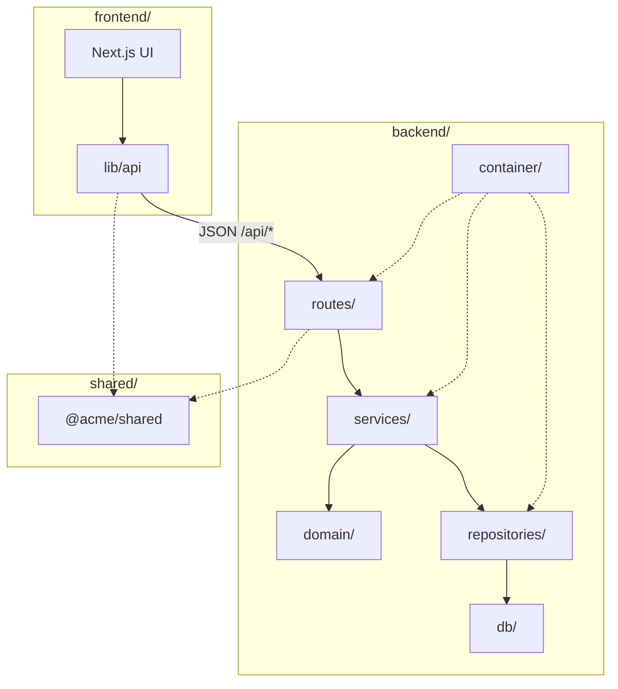

# Engineering Standards

How we build ACME Salary Platform: **TDD**, **SOLID**, **dependency injection**, and testable layers.  
This doc is the source of truth — see also [architecture.md](./architecture.md) and [roadmap.md](./roadmap.md).

---

## 1. Architecture

Layered monorepo architecture. **Mermaid diagrams** (context, system overview, backend flow, feature map) live in [architecture.md](./architecture.md).



### Folder layout (backend)

```
backend/src/
├── container/           # createContainer() — single composition root
├── domain/              # Pure functions & types, zero imports from db/
├── repositories/
│   ├── interfaces/      # IEmployeeRepository, ICompensationRepository
│   └── drizzle/         # DrizzleEmployeeRepository, etc.
├── services/            # EmployeeService, CompensationService, …
├── routes/              # Thin Express routers
├── validators/          # Zod schemas per endpoint
├── middleware/
├── config/
└── db/
```

---

## 2. SOLID applied here

| Principle | Rule in this project |
|-----------|---------------------|
| **S** — Single Responsibility | Routes handle HTTP. Services handle one use case. Repos handle persistence. |
| **O** — Open/Closed | Extend via new service methods or repository impls; don't modify working use cases for unrelated features. |
| **L** — Liskov Substitution | Tests swap `DrizzleEmployeeRepository` with `InMemoryEmployeeRepository` via the same interface. |
| **I** — Interface Segregation | Small repo interfaces (`findPaginated`, `findById`) — not one giant `IDataAccess`. |
| **D** — Dependency Inversion | Services depend on `IEmployeeRepository`, never on Drizzle or SQL directly. |

---

## 3. Dependency injection

We use **manual constructor injection** (no DI framework). One composition root:

```typescript
// container/index.ts
export function createContainer(db: DrizzleDb) {
  const employeeRepo = new DrizzleEmployeeRepository(db);
  const compensationRepo = new DrizzleCompensationRepository(db);

  const employeeService = new EmployeeService(employeeRepo, compensationRepo);

  return {
    employeeService,
    employeeRepo, // exposed for integration tests if needed
  };
}
```

```typescript
// services/employee.service.ts
export class EmployeeService {
  constructor(
    private readonly employees: IEmployeeRepository,
    private readonly compensation: ICompensationRepository,
  ) {}

  async list(query: ListEmployeesQuery): Promise<PaginatedEmployees> {
    return this.employees.findPaginated(query);
  }
}
```

```typescript
// routes/employees.route.ts — receives service via factory
export function createEmployeeRouter(deps: { employeeService: EmployeeService }) {
  const router = Router();
  router.get("/", async (req, res, next) => {
    try {
      const query = listEmployeesSchema.parse(req.query);
      const result = await deps.employeeService.listEmployees(query);
      res.json(result);
    } catch (err) {
      next(err);
    }
  });
  return router;
}
```

**Rules:**
- Dependencies flow **inward** (route → service → repository interface).
- `createContainer()` is the **only** place that `new` concrete repository classes.
- Tests construct services with **fake/in-memory** repositories.

---

## 4. TDD workflow

Every feature in [roadmap.md](./roadmap.md) follows **Red → Green → Refactor**.

### Order of tests

1. **Domain / pure logic** — fastest, no DB  
   `domain/compensation.test.ts`
2. **Service** — mock repositories  
   `services/compensation.service.test.ts`
3. **Repository** — in-memory SQLite  
   `repositories/drizzle/employee.repository.test.ts`
4. **HTTP integration** — Supertest + test DB  
   `tests/employees.integration.test.ts`
5. **Frontend** — component / API client (when UI added)  
   `frontend/lib/api/employees.test.ts`

### Example: append-only compensation (PRD §4.3)

```typescript
// 1. RED — write first
describe("CompensationService.recordChange", () => {
  it("inserts a new history row and never updates existing rows", async () => {
    const repo = new InMemoryCompensationRepository();
    const service = new CompensationService(repo);
    await service.recordChange({ employeeId: "E001", baseSalary: 50000, ... });
    await service.recordChange({ employeeId: "E001", baseSalary: 55000, ... });
    expect(await repo.count()).toBe(2);
    expect(repo.update).toBeUndefined(); // no update method exists
  });

  it("rejects negative base salary", async () => {
    const service = new CompensationService(new InMemoryCompensationRepository());
    await expect(service.recordChange({ baseSalary: -1, ... })).rejects.toThrow();
  });
});

// 2. GREEN — minimal implementation
// 3. REFACTOR — extract validation to domain/
```

### What we don't do

- Skip tests and "add them later"
- Test implementation details (internal private methods)
- Hit production DB in tests — use `:memory:` SQLite
- Put business rules in route handlers or React components

---

## 5. Repository pattern

```typescript
// repositories/interfaces/employee.repository.ts
export interface IEmployeeRepository {
  findPaginated(query: ListEmployeesQuery): Promise<Paginated<Employee>>;
  findById(id: string): Promise<Employee | null>;
  insertEmployee(employee: CreateEmployeeInput): Promise<Employee>;
  updateEmployee(id: string, employee: UpdateEmployeeInput): Promise<Employee>;
  deleteEmployee(id: string): Promise<void>;
  upsertManyEmployees(employees: EmployeeSpreadsheetRow[]): Promise<EmployeeImportResult>;
}

// repositories/drizzle/employee.repository.ts
export class DrizzleEmployeeRepository implements IEmployeeRepository {
  constructor(private readonly db: DrizzleDb) {}
  // Drizzle queries only here — no HTTP, no business rules
}
```

**Compensation history repository:** expose `insert()` only. No `update()` or `delete()`.

---

## 6. Domain rules (non-negotiable)

From the PRD — enforce in **domain/** or **services/**, always covered by tests:

| Rule | Enforcement |
|------|-------------|
| Append-only history | `ICompensationRepository` has no update/delete |
| Employee delete guard | `EmployeeService.deleteEmployee` rejects when history exists |
| Reason enum | Zod + shared `COMPENSATION_REASONS` |
| Salary increase reasons | Annual Increment & Promotion cannot reduce salary vs predecessor |
| Effective date required | `recordCompensationChangeSchema` rejects empty dates |
| Salary > 0 | Domain validator |
| ISO 4217 currency | Domain validator (3-letter) |
| Currency isolation | Analytics never sums across currencies |
| Import all-or-nothing | Single transaction; rollback on any invalid row |
| AI safety | Intent → whitelisted function only; no dynamic SQL |

---

## 7. API conventions

- Prefix: `/api/*`
- JSON: **camelCase**
- DB columns: **snake_case**
- Validate input/output with **Zod**; share schemas via `@acme/shared` where possible
- Pagination: `{ data, meta: { page, limit, total, totalPages } }`
- Errors: `{ error, message }` (existing middleware)

---

## 8. Frontend conventions

- **Server Components** fetch data; **Client Components** for interactivity only
- No business logic in components — call API, render results
- API calls go through `lib/api/*` using shared types
- Forms that mutate → Client Component + server action or API POST
- Virtualize long lists (employee directory)

---

## 9. Git & PR discipline

- One roadmap item per PR when possible
- PR must include tests for the feature
- PR description references roadmap item (e.g. "Phase 2.1 — list employees")
- `npm test && npm run lint && npm run typecheck` must pass

---

## 10. References

| Doc | Purpose |
|-----|---------|
| [PRD](./ACME_Salary_Management_PRD_Final.pdf) | Product requirements |
| [roadmap.md](./roadmap.md) | Feature delivery plan (phases 0–7) |
| [engineering-standards.md](./engineering-standards.md) | TDD, SOLID, DI, repository pattern |
| [architecture.md](./architecture.md) | Stack & repo layout |
| [AGENTS.md](../AGENTS.md) | AI agent instructions |
| `.cursor/rules/` | Persistent Cursor rules |
