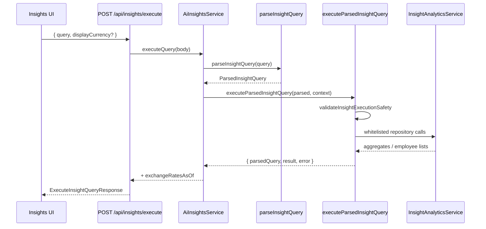
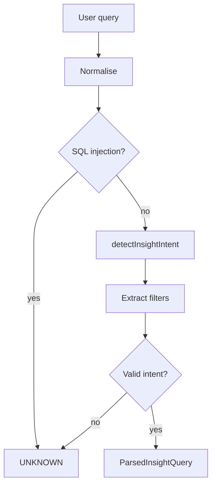

# Insight query engine

The **Insights** feature (`/insights`) lets HR users ask compensation questions in plain English. A **rule-based query parser** on the backend maps each question to a **whitelisted intent** and optional filters. A matching **executor** then runs predefined analytics queries against PostgreSQL — there is no LLM and no dynamic SQL.

Contracts (`ParsedInsightQuery`, result types, Zod request schemas) live in `@acme/shared`. Implementation lives under `backend/src/domain/insights/`.

See also: [architecture.md](./architecture.md#analytics--insights-data-flow) for how Insights fits the wider system.

---

## End-to-end flow



**Parse-only path:** `POST /api/insights/parse` runs `parseInsightQuery` and returns the structured intent without hitting analytics repositories. The UI uses the combined **execute** endpoint in normal use.

**Frontend:** `useInsightQueryParser` (`frontend/lib/hooks/use-insight-query-parser.ts`) posts to execute, holds query/response state, and re-runs the last query when display currency changes.

---

## Design principles

| Principle | What it means in practice |
|-----------|---------------------------|
| **Whitelist, don't generate** | Only `AI_INSIGHT_INTENTS` in `shared/src/ai-insights.ts` can run. Each intent has a dedicated executor in `executors.ts`. |
| **Regex + extractors, not NLP** | Intent detection uses ordered patterns in `intent-patterns.ts`. Filters use small focused extractors under `filters/` and `timeline/`. |
| **Fail closed on unsafe input** | SQL-like tokens are rejected early. Parsed values are validated against allow-lists before execution. |
| **Reuse analytics data** | Executors call `InsightAnalyticsService` (same repositories as the executive dashboard), with FX conversion at execution time. |

---

## `ParsedInsightQuery`

The parser output is a fixed shape shared between backend and frontend:

| Field | Type | Description |
|-------|------|-------------|
| `intent` | `AiInsightIntent` | Metric or timeline action to run (`AVG_DEPT_SALARY`, `TOP_EARNERS`, …, or `UNKNOWN`) |
| `originalQuery` | `string` | Trimmed, whitespace-normalised user text |
| `department` | `string \| null` | One of `INSIGHT_QUERY_DEPARTMENTS` if detected |
| `country` | `string \| null` | One of `INSIGHT_QUERY_COUNTRIES` if detected |
| `jobTitle` | `string \| null` | Free-text title (e.g. from “joined as Staff Engineer”) |
| `currency` | `string \| null` | ISO code if mentioned in the query (`USD`, `GBP`, `EUR`, `INR`, `SGD`) |
| `months` | `number \| null` | Relative lookback for timeline intents (default **3** when omitted) |
| `sinceDate` | `string \| null` | Absolute start date (`YYYY-MM-DD`) for timeline intents |
| `limit` | `number \| null` | Top/bottom N (1–25; defaults to analytics top-earners limit when omitted) |
| `medianSplitFocus` | `"below" \| "above" \| "both" \| null` | For `MEDIAN_SPLIT_COUNTS` only |

---

## Parse pipeline

`parseInsightQuery` (`backend/src/domain/insights/parse-query.ts`) runs in order:

1. **Normalise** — trim and collapse whitespace.
2. **Safety pre-check** — `looksLikeSqlInjection` rejects `SELECT`, `DROP`, `--`, `;`, etc. → `UNKNOWN`.
3. **Detect intent** — first matching pattern in `INSIGHT_INTENT_PATTERNS` wins (order matters; see below).
4. **Extract filters** — currency, country, department, job title, timeline window, ranked limits, median-split focus.
5. **Validate parse** — `UNKNOWN` intent, or `MEDIAN_SPLIT_COUNTS` without a focus → `UNKNOWN`.



### Intent detection order

Patterns are tested **top to bottom** in `intent-patterns.ts`. More specific timeline phrases are listed before generic salary aggregates so that, for example, “salary hike in the last 3 months” maps to `RECENT_SALARY_INCREASES`, not `AVG_DEPT_SALARY`.

Rough priority:

1. Timeline — salary increases, new hires, promotions  
2. Median distribution — split counts, near-median earners  
3. Aggregates — median/average salary, headcount, payroll  
4. Ranked lists — top/bottom earners  

---

## Supported intents

| Intent | Example phrases | Typical result |
|--------|-----------------|----------------|
| `AVG_DEPT_SALARY` | “average salary in Engineering”, “avg pay in India” | Mean salary + employee count |
| `MEDIAN_DEPT_SALARY` | “median salary in HR” | Median salary + count |
| `HEADCOUNT` | “headcount”, “how many employees in UK” | Employee count |
| `TOTAL_PAYROLL` | “total payroll”, “payroll cost for Engineering in India” | Sum of base salaries |
| `TOP_EARNERS` | “top earners”, “top 5 earners in Engineering” | Ranked employee list |
| `BOTTOM_EARNERS` | “least earners”, “bottom 3 earners in HR” | Ranked employee list |
| `NEAR_MEDIAN_EARNERS` | “who earn around the median” | Employees within ±10% of median |
| `MEDIAN_SPLIT_COUNTS` | “below and above median”, “below median in India” | Counts below/above median |
| `RECENT_PROMOTIONS` | “promoted in the last 3 months”, “promotions since 2025-06-01” | Timeline events (`Promotion`) |
| `RECENT_NEW_HIRES` | “new joiners”, “joined as engineers in the last 12 months” | Timeline events (`New Hire`) |
| `RECENT_SALARY_INCREASES` | “salary hike”, “got a raise in the last 3 months” | Timeline events (`Annual Increment`, `Market Adjustment`) |
| `UNKNOWN` | Unsupported or unsafe questions | Error: “This question is not supported yet.” |

**UI examples:** the “Try” chips on `/insights` mirror `frontend/lib/insight-example-queries.ts`. Those queries are also asserted in `parse-query.test.ts` to resolve to a non-`UNKNOWN` intent.

---

## Filter extraction

### Departments

Canonical values: `Engineering`, `HR`, `Finance`, `Sales`, `Operations` (`INSIGHT_QUERY_DEPARTMENTS`).

Aliases include `engineers` → Engineering, `ops` → Operations, `human resources` → HR (`filters/department.ts`).

### Countries

Canonical codes: `US`, `UK`, `SG`, `DE`, `IN` (`INSIGHT_QUERY_COUNTRIES`).

Recognises names (`India`, `USA`, `UK`), common typos (`Inida`), and patterns like `in IN` or `for UK` (`filters/country.ts`).

### Job titles

- **Joined-as phrasing:** “employees who joined as **Staff Engineer** in the last 6 months” → `jobTitle: "Staff Engineer"`.
- If the joined-as phrase matches a department alias (`engineers`), it becomes a **department** filter instead.
- Other patterns: `with title …`, `as a …` (`filters/job-title.ts`).

### Currency

ISO codes embedded in the query (`USD`, `GBP`, …) override the UI display currency at execution time (`execution-currency.ts`). If the query omits currency, the user’s **display currency** is used; otherwise **USD**.

### Timeline window

For `RECENT_*` intents only (`timeline/window.ts`):

| Pattern | Effect |
|---------|--------|
| `last N months` / `past 6 months` | `months: N` |
| `last N weeks` | `months: ceil(N / 4)` (minimum 1) |
| `last N years` | `months: N × 12` |
| `since 2025-06-01` / `after June 2025` | `sinceDate` set; `months` cleared |
| *(no window mentioned)* | `months: 3` (`DEFAULT_INSIGHT_TIMELINE_MONTHS`) |

### Ranked limits

- `top 5 earners` → `limit: 5` (capped at **25**).
- `bottom 3 earners` → `limit: 3`.
- If omitted, executors use the default analytics top-earners limit.

### Median split focus

Required for `MEDIAN_SPLIT_COUNTS`:

- “below and above median” → `both`
- “below median” → `below`
- “above median” → `above`

If the intent matches but focus cannot be determined, the query is treated as `UNKNOWN`.

---

## Execution layer

`executeParsedInsightQuery` (`execute-query.ts`):

1. `validateInsightExecutionSafety` — allow-listed department/country/currency, job title length, limit bounds.
2. Reject `UNKNOWN` with `UNSUPPORTED_INTENT`.
3. Dispatch to `INSIGHT_EXECUTORS[intent]`.

Each executor:

- Builds an `InsightQuerySpec` via `query-spec.ts` (metric + which filters apply).
- Maps filters to `EmployeeScopeParams` (country, department, jobTitle).
- Calls injected analytics methods (summary, salary stats, top/bottom earners, timeline events, etc.).
- Returns a typed `InsightExecutionResult` or `null` with an `InsightExecutionError`.

**Filter support per metric** is declared in `METRIC_FILTER_SUPPORT` inside `query-spec.ts` (e.g. timeline intents support `months` / `sinceDate`; salary aggregates do not).

---

## Safety and errors

| Stage | Check | Error kind |
|-------|-------|------------|
| Parse | SQL injection patterns | `UNKNOWN` (no execution) |
| Execute | Re-validates injection + allow-lists | `REJECTED_INPUT` |
| Execute | Unrecognised intent | `UNSUPPORTED_INTENT` |
| Execute | Scoped query with no matching employees | Empty result (not always an error) |

Allow-lists are enforced in `safety.ts` and `validate-execution.ts`. Department and country values must match shared enums even if regex extraction returns something else.

---

## API

| Method | Path | Body | Response |
|--------|------|------|----------|
| `POST` | `/api/insights/parse` | `{ query: string }` | `ParsedInsightQuery` |
| `POST` | `/api/insights/execute` | `{ query: string, displayCurrency?: string }` | `ExecuteInsightQueryResponse` |

Request validation: `insightQueryRequestSchema` (query 1–500 chars, optional display currency).

`ExecuteInsightQueryResponse` includes:

- `parsedQuery` — structured parse
- `result` — typed payload for the intent, or `null`
- `error` — `{ kind, message }` or `null`
- `exchangeRatesAsOf` — FX snapshot date used for conversion

---

## Source layout

```
backend/src/domain/insights/
├── parse-query.ts          # main parser entry
├── intent-patterns.ts      # intent regex table (order matters)
├── execute-query.ts        # executor dispatch
├── executors.ts            # per-intent implementations
├── query-spec.ts           # metric ↔ filter matrix
├── validate-execution.ts   # pre-execution safety
├── safety.ts               # injection + allow-list helpers
├── execution-currency.ts   # query vs display currency
├── filters/
│   ├── department.ts
│   ├── country.ts
│   ├── job-title.ts
│   ├── ranked-limits.ts
│   └── median-split.ts
└── timeline/
    ├── timeline.ts         # intent ↔ compensation reasons
    └── window.ts           # months / sinceDate extraction

shared/src/ai-insights.ts   # intents, types, Zod schemas
frontend/lib/hooks/use-insight-query-parser.ts
frontend/lib/insight-example-queries.ts
```

---

## Adding a new intent

1. **Contract** — add the intent to `AI_INSIGHT_INTENTS`, define a result type, and extend `InsightExecutionResult` in `shared/src/ai-insights.ts`.
2. **Pattern** — add a regex to `INSIGHT_INTENT_PATTERNS` at the correct priority position.
3. **Filters** — extend `parse-query.ts` or filter modules if the intent needs new extractions.
4. **Query spec** — add a row to `METRIC_FILTER_SUPPORT` in `query-spec.ts`.
5. **Executor** — implement `execute…Intent` in `executors.ts` and register it in `INSIGHT_EXECUTORS`.
6. **Analytics** — add a repository/service method if existing analytics APIs are insufficient.
7. **Tests** — cases in `parse-query.test.ts`, `execute-query.test.ts`, and any new extractor tests.
8. **UI** — optional example query in `insight-example-queries.ts`; `InsightExecutionResult` rendering in `insight-execution-result.tsx`.

Keep executors **thin**: parse → validate → call whitelisted data access → map to shared result types.

---

## Testing

| Area | Location |
|------|----------|
| Parser examples & edge cases | `backend/src/domain/insights/parse-query.test.ts` |
| Intent patterns | Covered indirectly via parse tests |
| Filter extractors | `filters/*.test.ts`, `timeline/*.test.ts` |
| Execution & safety | `execute-query.test.ts`, `validate-execution.test.ts` |
| HTTP integration | `backend/tests/` (Supertest against `/api/insights/*`) |
| Frontend hook | `frontend/lib/hooks/use-insight-query-parser.test.ts` |

Run backend domain tests:

```bash
npm test -w backend -- src/domain/insights
```

---

## Known limits (MVP)

- **English only** — no i18n or stemming; phrasing must match supported patterns.
- **Single intent per query** — no compound questions (“average salary and headcount”).
- **Fixed vocabularies** — departments and countries are enum-based, not free text from the database.
- **No semantic search** — “tell me about pay” will not infer an intent.
- **First-match wins** — ambiguous wording follows pattern order, not user disambiguation.

These limits are intentional: they keep the engine predictable, testable, and safe for production HR data.
